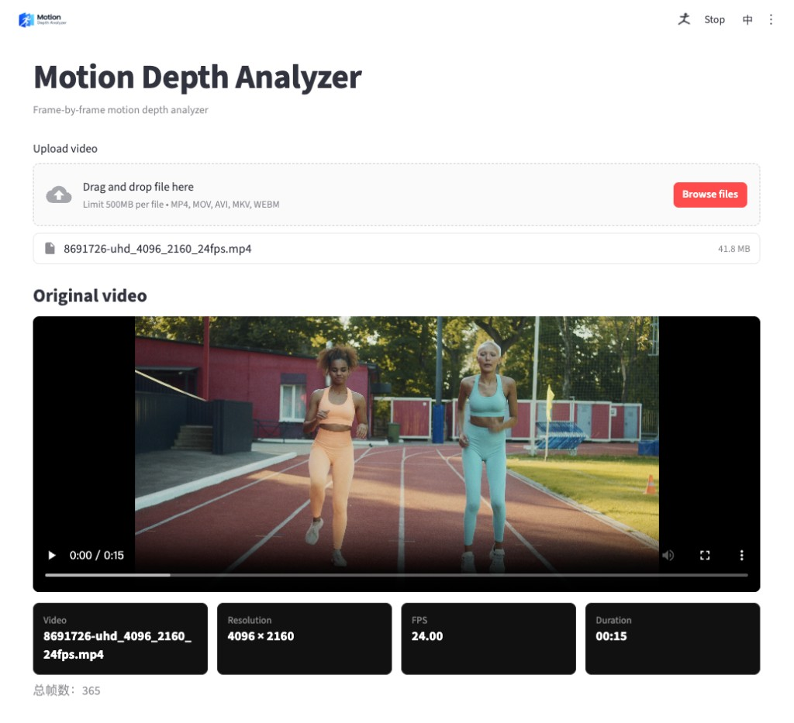

<p align="center">
  
</p>

<h3 align="center">Turn a reference clip into near-white / far-black motion so generative models see the action, not the set</h3>

<p align="center">Action in. Background out.</p>

<p align="center">
  <a href="#demo"><strong>Demo</strong></a>
  &nbsp;•&nbsp;
  <a href="#install"><strong>Install</strong></a>
  &nbsp;•&nbsp;
  <a href="#usage"><strong>Usage</strong></a>
  &nbsp;•&nbsp;
  <a href="README.zh-CN.md"><strong>简体中文</strong></a>
</p>

<p align="center">
  
  
  
  
</p>

---

## Demo

<p align="center">
  
</p>

Web UI on a short running clip: source preview, then original vs depth side by side.

| Region | Meaning |
| --- | --- |
| **Bright (white)** | Closer to the camera |
| **Dark (black)** | Farther background |
| **Mid gray** | Mid-range surfaces after gamma / crush |

The deliverable is an H.264 MP4 under `output/`, not the preview JPEGs.

---

## What it does

The pipeline turns each frame into a **relative** depth map and stylizes it as a grayscale video. It does not output meters, trajectories, or camera pose.



- **Web UI** at `http://127.0.0.1:8000`: drag-and-drop upload, source preview, live progress, stop, side-by-side result, download
- **CLI** with the same pipeline and parameters
- **Relative depth** stylized as near-white / far-black grayscale video
- **Stop a running job** without killing the server
- **Chinese / English**, light / dark / system theme
- **Clear cache** to wipe local `input/` and `output/` files
- Runs on **CUDA, Apple MPS, or CPU**

---

## How it works

```text
local video → frame read → Depth Anything V2 Small
           → grayscale depth → optional temporal smooth → H.264 MP4
```

1. **Read frames.** OpenCV reads the clip at source resolution and FPS.
2. **Relative depth.** Depth Anything V2 Small infers a per-frame map. `--scale` downsamples for speed; `--stride` reuses the last map on skipped frames.
3. **Stylize.** Percentile normalize, optional invert so near is white, crush distant background toward black, apply gamma.
4. **Temporal EMA.** `--smooth` blends consecutive maps to reduce flicker (`0` = off).
5. **Encode.** FFmpeg writes browser-playable H.264 and can mux the original soundtrack. Without FFmpeg, OpenCV still writes a file, but playback and audio may fail.

---

## Install

Requirements:

- Python 3.10+
- [FFmpeg](https://ffmpeg.org/) (recommended: browser-playable H.264 and original audio)
- A machine that can run PyTorch (NVIDIA CUDA, Apple Silicon MPS, or CPU)

Install FFmpeg:

```bash
# macOS
brew install ffmpeg

# Ubuntu / Debian
sudo apt install ffmpeg

# Windows (winget)
winget install FFmpeg
```

Then:

```bash
git clone https://github.com/bulici93/motion-depth-analyzer.git
cd motion-depth-analyzer
python3 -m venv .venv
source .venv/bin/activate   # Windows: .venv\Scripts\activate
pip install -e .
```

Install a CUDA build of `torch` from [pytorch.org/get-started/locally](https://pytorch.org/get-started/locally/) if you have an NVIDIA GPU. Use a dedicated venv.

The first process run downloads **~100MB** of weights into `~/.cache/huggingface/`. If Hugging Face is slow or blocked, set a mirror, for example:

```bash
export HF_ENDPOINT=https://hf-mirror.com
```

---

## Usage

### Web UI

```bash
depth-capture-web
```

Or:

```bash
python -m depth_capture.server
```

Then open [http://127.0.0.1:8000](http://127.0.0.1:8000). The server binds to localhost only.

Typical flow:

1. Drop or browse a video (`mp4` / `mov` / `avi` / `mkv` / `webm`, up to 500MB)
2. Check resolution, FPS, duration, and frame count
3. Adjust depth parameters if needed
4. Start processing; watch the live preview, or **Stop** to cancel
5. Preview original vs depth, then download the MP4

The UI is static HTML/CSS/JS served by FastAPI. No Node toolchain is required.

The ⋮ menu has appearance pills (system / light / dark) and **Clear cache**, which deletes files under `input/` and `output/`. Stop any running job first.

A leftover Streamlit entry (`streamlit run app.py`) still exists but is **not** the primary UI.

### CLI

```bash
depth-capture --input fight.mp4 --output fight_depth.mp4 --scale 0.5
```

Or:

```bash
python -m depth_capture -i fight.mp4 -o fight_depth.mp4
```

If `--output` is omitted, the file is written to `output/<stem>_depth.mp4`.

### Parameters

| Flag | Default | Meaning |
| --- | --- | --- |
| `--scale` | `0.5` | Inference resolution (`0.25`–`1.0`). Lower is faster, with slightly less detail. |
| `--stride` | `1` | Run the model every N frames; in-between frames reuse the last depth map. |
| `--gamma` | `0.7` | Grayscale curve. Below 1 brightens near objects; above 1 darkens the map. |
| `--crush` | `35` | Percentile used to push distant background toward black. |
| `--smooth` | `0.4` | Temporal EMA (`0` = off). Reduces flicker across frames. |
| `--no-audio` | off | Do not copy the original soundtrack. |
| `--model-id` | Depth Anything V2 Small | Override the Hugging Face model id. |
| `--quiet` | off | Less logging / hide the progress bar. |

The same values are exposed as sliders in the Web UI.

Override the model with `DEPTH_CAPTURE_MODEL_ID` if needed. The documented default remains **V2 Small**.

---

## Output

| Path | Role |
| --- | --- |
| `input/` | Uploaded source videos |
| `output/<stem>_depth.mp4` | Deliverable: grayscale depth video (H.264 when FFmpeg is available) |
| `output/jobs.json` | Web job records |
| `output/previews/` | Live preview JPEGs (not the deliverable) |
| `~/.cache/huggingface/` | Downloaded model weights |

`input/` and `output/` are gitignored. They are local cache, not source. README demo files under `assets/` are the exception.

Without FFmpeg, the pipeline can still write a video via OpenCV, but browser playback and audio muxing may fail.

---

## Technical details

| Component | Value |
| --- | --- |
| Depth model | `depth-anything/Depth-Anything-V2-Small-hf` (~100MB) |
| Depth type | Relative (not meters) |
| Stylize | 1–99 percentile normalize, polarity invert, crush, gamma |
| Temporal | EMA (`--smooth`, default `0.4`) |
| Device | CUDA → MPS → CPU |
| Video write | ffmpeg `libx264` when available; OpenCV fallback otherwise |
| Web | FastAPI + static `web/` on `127.0.0.1:8000` |

On Apple Silicon, `PYTORCH_ENABLE_MPS_FALLBACK=1` is set automatically.

CPU works but is slow. For a quicker trial, lower `--scale` (for example `0.25`) and raise `--stride`.

---

## Known limitations

| # | Limitation | Why it matters |
| --- | --- | --- |
| 1 | **Relative depth only** | Values are not metric (meters). This is not visual odometry. |
| 2 | **Per-frame inference** | Depth Anything V2 does not look across time. Long shots can flicker; EMA helps but does not remove it. |
| 3 | **One Web job at a time** | The UI does not queue parallel processes. |
| 4 | **500MB upload cap** | Larger clips belong on the CLI. |
| 5 | **FFmpeg recommended** | Without it, H.264 and original audio may be missing; browsers may not play the file. |
| 6 | **Image model, not a temporal depth model** | This is not Video-Depth-Anything or a 6-DoF camera tracker. |

---

## Project layout

```text
motion-depth-analyzer/
├── src/depth_capture/   pipeline, model wrapper, FastAPI server, CLI
├── web/                 static UI (HTML / CSS / JS) + logo
├── tests/               pytest suite with a fake depth engine
├── assets/              README demo files
├── input/  output/      runtime files (gitignored)
├── README.md
├── README.zh-CN.md
└── pyproject.toml
```

Raw uploads and run outputs stay out of git. README images under `assets/` are the exception.

---

## Tests

```bash
pip install -e ".[dev]"
pytest
```

GitHub Actions runs the same tests on Python 3.10 and 3.12 **without** downloading model weights.

---

## License

Apache License 2.0. See [LICENSE](LICENSE).

Depth Anything V2 is by Lihe Yang et al. (NeurIPS 2024). This project only calls the Hugging Face Transformers checkpoint and is not affiliated with the original authors. Use of the weights is subject to their license.
