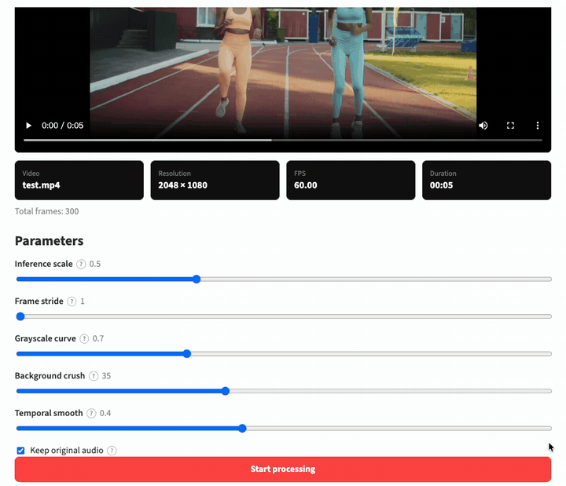
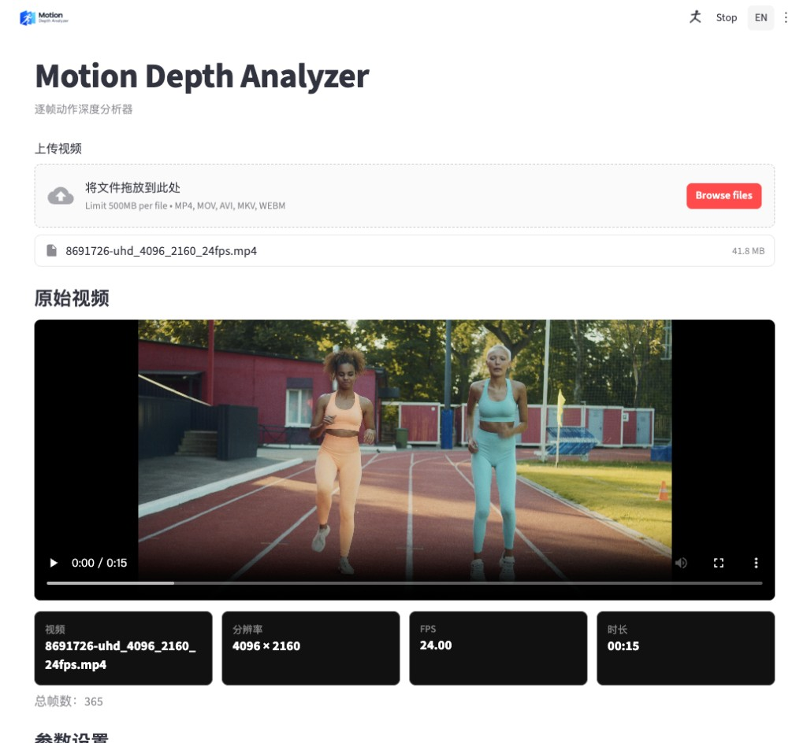

<p align="center">
  
</p>

<h3 align="center">把参考视频提炼近白远黑的动作片，给生成模型去掉背景噪音</h3>

<p align="center">只留动作，不留场景。</p>

<p align="center">
  <a href="#demo"><strong>Demo</strong></a>
  &nbsp;•&nbsp;
  <a href="#安装"><strong>安装</strong></a>
  &nbsp;•&nbsp;
  <a href="#使用"><strong>使用</strong></a>
  &nbsp;•&nbsp;
  <a href="README.md"><strong>English</strong></a>
</p>

<p align="center">
  
  
  
  
</p>

---

## Demo

<p align="center">
  
</p>

Web 界面处理一段跑步短片：先看源片预览，再并排对照原片与深度结果。

| 区域 | 含义 |
| --- | --- |
| **亮（白）** | 更靠近相机 |
| **暗（黑）** | 更远的背景 |
| **中间灰** | 经过 gamma / crush 后的中景 |

最终交付物是 `output/` 下的 H.264 MP4，预览 JPEG 不是交付物。

---

## 做什么

管线把每一帧变成**相对**深度图，再风格化成灰度视频。不输出米、轨迹或相机位姿。



- **Web 界面** `http://127.0.0.1:8000`：拖放上传、源片预览、实时进度、停止任务、左右对比、下载结果
- **命令行**，与网页共用同一套管线与参数
- **相对深度**，输出近白远黑的灰度视频
- 处理中可 **停止任务**，不必关掉服务
- **中 / 英** 界面，浅色 / 深色 / 跟随系统
- **清除缓存**，删除本地 `input/`、`output/` 中的文件
- 自动选择 **CUDA、Apple MPS 或 CPU**

---

## 怎么工作

```text
本地视频 → 逐帧读取 → Depth Anything V2 Small
        → 灰度深度图 → 可选时序平滑 → H.264 MP4
```

1. **读帧。** OpenCV 按源分辨率和帧率打开片子。
2. **相对深度。** Depth Anything V2 Small 逐帧推理。`--scale` 降分辨率换速度；`--stride` 在跳过的帧上复用上一张深度图。
3. **风格化。** 分位数归一化，必要时反转使近处为白，把远处背景压向黑色，再套 gamma。
4. **时序 EMA。** `--smooth` 混合相邻帧以减轻闪烁（`0` 关闭）。
5. **编码。** FFmpeg 写出浏览器可播的 H.264，并可混入原声。没有 FFmpeg 时仍可用 OpenCV 写文件，但播放和音频可能失败。

---

## 安装

环境：

- Python 3.10+
- [FFmpeg](https://ffmpeg.org/)（推荐，用于浏览器可播的 H.264 以及保留原声）
- 可运行 PyTorch 的机器（NVIDIA CUDA / Apple Silicon MPS / CPU）

安装 FFmpeg：

```bash
# macOS
brew install ffmpeg

# Ubuntu / Debian
sudo apt install ffmpeg

# Windows (winget)
winget install FFmpeg
```

然后：

```bash
git clone https://github.com/bulici93/motion-depth-analyzer.git
cd motion-depth-analyzer
python3 -m venv .venv
source .venv/bin/activate   # Windows: .venv\Scripts\activate
pip install -e .
```

有 NVIDIA 显卡时，请按 [pytorch.org/get-started/locally](https://pytorch.org/get-started/locally/) 安装对应 CUDA 版 `torch`。请使用独立虚拟环境。

首次处理会把约 **100MB** 权重下载到 `~/.cache/huggingface/`。若 Hugging Face 访问较慢，可设置镜像，例如：

```bash
export HF_ENDPOINT=https://hf-mirror.com
```

---

## 使用

### Web 界面

```bash
depth-capture-web
```

或：

```bash
python -m depth_capture.server
```

然后打开 [http://127.0.0.1:8000](http://127.0.0.1:8000)。服务默认只监听本机。

典型流程：

1. 拖放或选择视频（`mp4` / `mov` / `avi` / `mkv` / `webm`，最大 500MB）
2. 查看分辨率、FPS、时长、总帧数
3. 按需调整深度参数
4. 开始处理；可看实时预览，或点 **停止任务**
5. 对比原片与深度结果，下载 MP4

界面是 FastAPI 托管的静态 HTML/CSS/JS，不需要 Node。

顶栏 ⋮ 菜单可切换外观（系统 / 浅色 / 深色），以及 **清除缓存**（删除 `input/`、`output/` 下的文件）。清除前请先停掉正在跑的任务。

旧的 Streamlit 入口（`streamlit run app.py`）仍保留，但**不是**主界面。

### 命令行

```bash
depth-capture --input fight.mp4 --output fight_depth.mp4 --scale 0.5
```

或：

```bash
python -m depth_capture -i fight.mp4 -o fight_depth.mp4
```

省略 `--output` 时，结果写到 `output/<文件名>_depth.mp4`。

### 参数

| 参数 | 默认 | 作用 |
| --- | --- | --- |
| `--scale` | `0.5` | 推理分辨率倍率（`0.25`–`1.0`），越小越快，细节略少 |
| `--stride` | `1` | 每 N 帧推理一次，中间帧复用上一张深度图 |
| `--gamma` | `0.7` | 灰阶曲线。小于 1 提亮近处，大于 1 整体更暗 |
| `--crush` | `35` | 把远处背景压向黑色的分位数 |
| `--smooth` | `0.4` | 时序平滑强度，`0` 关闭，用于减轻闪烁 |
| `--no-audio` | 关 | 不保留原声 |
| `--model-id` | V2 Small | 覆盖 Hugging Face 模型 ID |
| `--quiet` | 关 | 减少日志 / 隐藏进度条 |

Web 界面的滑条对应同一组参数。

也可用环境变量 `DEPTH_CAPTURE_MODEL_ID` 覆盖模型。文档默认仍是 **V2 Small**。

---

## 输出

| 路径 | 作用 |
| --- | --- |
| `input/` | 上传的源视频 |
| `output/<stem>_depth.mp4` | 交付物：灰度深度视频（有 FFmpeg 时为 H.264） |
| `output/jobs.json` | Web 任务记录 |
| `output/previews/` | 实时预览 JPEG（不是交付物） |
| `~/.cache/huggingface/` | 下载的模型权重 |

`input/`、`output/` 已加入 `.gitignore`，属于本地缓存，不要提交。README 演示文件放在 `assets/`，作为例外。

没有 FFmpeg 时仍可能用 OpenCV 写出视频，但浏览器播放和原声封装可能失败。

---

## 技术细节

| 组件 | 值 |
| --- | --- |
| 深度模型 | `depth-anything/Depth-Anything-V2-Small-hf`（约 100MB） |
| 深度类型 | 相对深度（不是米） |
| 风格化 | 1–99 分位数归一化、极性反转、crush、gamma |
| 时序 | EMA（`--smooth`，默认 `0.4`） |
| 设备 | CUDA → MPS → CPU |
| 视频写出 | 有 ffmpeg 时用 `libx264`；否则 OpenCV 回退 |
| Web | FastAPI + 静态 `web/`，监听 `127.0.0.1:8000` |

Apple Silicon 会设置 `PYTORCH_ENABLE_MPS_FALLBACK=1`。

CPU 可用但较慢。试跑时可把 `--scale` 降到 `0.25`，并提高 `--stride`。

---

## 已知限制

| # | 限制 | 影响 |
| --- | --- | --- |
| 1 | **只有相对深度** | 数值不是米。这不是视觉里程计。 |
| 2 | **按帧独立推理** | Depth Anything V2 不看时序。长镜头可能闪烁；EMA 能减轻，去不干净。 |
| 3 | **Web 同时只跑一个任务** | 界面没有并行队列。 |
| 4 | **上传上限 500MB** | 更大的片子请用命令行。 |
| 5 | **建议安装 FFmpeg** | 没有它时可能没有 H.264 和原声，浏览器也可能播不了。 |
| 6 | **图像模型，不是时序深度模型** | 不是 Video-Depth-Anything，也不是 6-DoF 相机跟踪。 |

---

## 项目结构

```text
motion-depth-analyzer/
├── src/depth_capture/   管线、模型封装、FastAPI 服务、CLI
├── web/                 静态界面（HTML / CSS / JS）+ logo
├── tests/               pytest，使用假深度引擎
├── assets/              README 演示文件
├── input/  output/      运行时文件（已忽略）
├── README.md
├── README.zh-CN.md
└── pyproject.toml
```

原始上传和运行输出不进 git。README 图片放在 `assets/`，作为例外。

---

## 测试

```bash
pip install -e ".[dev]"
pytest
```

GitHub Actions 在 Python 3.10 与 3.12 上跑同一套测试，**不会**下载真实权重。

---

## 许可

Apache License 2.0，见 [LICENSE](LICENSE)。

Depth Anything V2 由 Lihe Yang 等人发表于 NeurIPS 2024。本项目仅调用 Hugging Face Transformers 权重，与原作者无隶属关系；权重使用遵循其许可。
